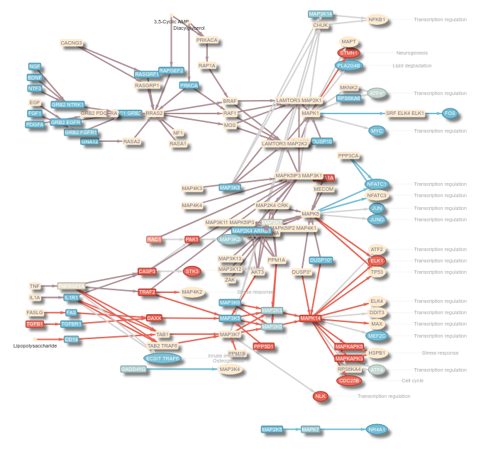
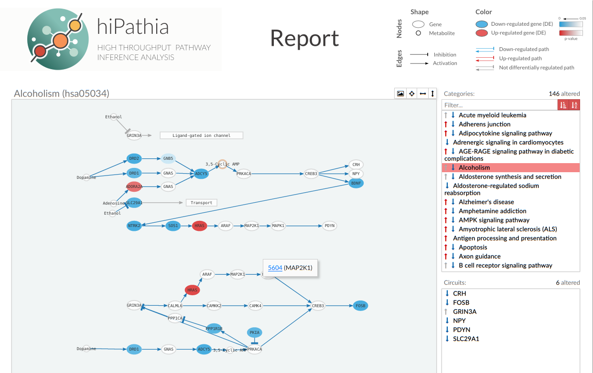

```{=tex}
\newpage
\section{Introduction}\label{sec:intro}
```
*Hipathia* package implements the Canonical Circuit Activity Analysis
method for the quantification of the signaling pathways activity
presented in [Hidalgo et
al](https://www.ncbi.nlm.nih.gov/pubmed/28042959). This method has been
implemented in the webtool <http://hipathia.babelomics.org>, allowing
the user to compare signal propagation in an experiment, and train and
use a predictor based on the activation of the canonical circuits or
subpathways. The package *hipathia* has been conceived as a functional
tool for R users which allows more control on the analysis pipeline than
the web implementation does.

This document will introduce you to the *hipathia* package and how to
use it to analyze your data.


<!-- The use of the package has three main steps: Data preprocessment, Pathway and function activation computation, and data analysis and visualization. -->

\section{Previous considerations}

*Hipathia* is a method for the computation of signal transduction along
signaling pathways taking as input transcriptomics data. The method is
independent on the pathways database, it only needs information about
the topology of the graph and the genes included in each node.

However, due to computational cost, *hipathia* needs to preprocess the
graphs to be fully efficient. In the current implementation we have
developed a module with 145 preprocessed KEGG pathway KGML files, which
are ready to be analyzed. In order to preprocess other pathways, see Section
\@ref(sec:newpathways) on how to create a new pathways object to analyze
your own graph pathways with *hipathia*.

Since version `3.0`, we have simplified the pipeline including the data
normalization step and the computation of the functional matrices into
the `hipathia()` function, introducing function `DAcomp()` to perform
differential activation comparisons of nodes, pathways and functions at
the same time, and function `DAreport()` to easily create a report. We
have also introduced different visualization functions, such as
`DAoverview()`, `DAsummary()`, `DAtop()` and `DApathway()`. All functions from 
previous versions remain available for further use (see Section \@ref(sec:old)), 
but we strongly recommend to
use the new ones to simplify the use of the package.

\subsection{Instalation}\label{sec:instalation}

In order to install the *hipathia* package, type on your R console

```{r, fig.show='hold', message=FALSE, warning=FALSE, eval=FALSE}
## try http:// if https:// URLs are not supported 
if (!requireNamespace("BiocManager", quietly=TRUE))
    install.packages("BiocManager")
BiocManager::install("hipathia")
```

\subsection{Example data}

In order to illustrate the *hipathia* package functionalities an example
dataset has been prepared. Data has been downloaded from [The Cancer
Genome Atlas](https://cancergenome.nih.gov/) data repository, from the
BRCA-US project, release 20. 20 tumor and 20 normal samples of RNA-Seq
data have been randomly selected and normalized.

Specifically, raw data has been corrected for batch effect using the
`ComBat()` function from package `r BiocStyle::Biocpkg("sva")`, then
corrected for RNA composition bias applying TMM normalization from
package `r Biocpkg("edgeR")`, and finally log-transformed.

```{r, echo=FALSE, message=FALSE, warning=FALSE}
library(devtools)
load_all("~/appl/hipathia/")
```

```{r, fig.show='hold', message=FALSE, warning=FALSE}
# library(hipathia)
data("brca")
brca
```

The dataset `brca` is a `r Biocpkg("SummarizedExperiment")` object,
including the gene expression of the 40 samples in the assay `raw`, and
the information about whether each sample comes from *Tumor* or *Normal*
tissues in the `group` columns of the `colData` dataFrame.

```{r, fig.show='hold', message=FALSE, warning=FALSE}
hhead(assay(brca), 4)
```

```{r, fig.show='hold', message=FALSE, warning=FALSE}
colData(brca)
```

\subsection{Accepted objects}

*Hipathia* has been designed to work with matrices encapsulated as
`r Biocpkg("SummarizedExperiment")` objects, in which also the
experimental design has been included. However, it is also possible to
work in *hipathia* with matrix objects, as long as the experimental
design is provided when needed.

Imagine we have the expression data stored in a matrix object called
`brca_data` and the experimental design stored in a data frame with one
column called `brca_design`. Then, in order to summarize this data in a
`r Biocpkg("SummarizedExperiment")` object we should only run:

```{r, fig.show='hold', message=FALSE, eval=FALSE}
brca <- SummarizedExperiment(assays=SimpleList(raw=brca_data), 
                             colData=brca_design)
```

Note that the data frame object provided as `colData` parameter should
be ordered as the columns in the matrix provided as assay. For further
information on this kind of objects please refer to
`r Biocpkg("SummarizedExperiment")`.

When executing a function which needs as input parameter the
experimental design (such as the comparison functions), parameter `group` 
may take two different objects. In
case parameter `data` is a matrix, `group` should be a vector giving the
class to which each sample belongs, in the same order than the data
matrix. In case parameter `data` is a `r Biocpkg("SummarizedExperiment")`, 
`group` may be either a vector as above, or the name of the column in the
`colData` `dataFrame` of the `r Biocpkg("SummarizedExperiment")` storing this
information.

In general, functions accepting both SummarizedExperiment and matrix
objects as input data and returning a data matrix object, will give as
output the same kind of object received. That is, if we apply function
`translate_data()` to a SummarizedExperiment object, we will obtain a
SummarizedExperiment, while applying the same function to a matrix
object will result in a matrix object as output.

\subsection{How to cite}

*Hipathia* is a free open-source software implementing the result of a
research work. If you use it, please support the research project by
citing:

Hidalgo, M. R., Cubuk, C., Amadoz, A., Salavert, F.,
Carbonell-Caballero, J., & Dopazo, J. (2017). High throughput estimation
of functional cell activities reveals disease mechanisms and predicts
relevant clinical outcomes. Oncotarget, 8(3), 5160--5178.
<http://doi.org/10.18632/oncotarget.14107>

```{=tex}
\newpage
\section{Preprocessment}\label{sec:pre}
```
<!-- \subsection{Preprocess data} -->

*Hipathia* accepts as input data a gene expression matrix. Expression
may have been measured with any available sequencing technique. However,
*hipathia* assumes that data has been already normalized for correcting
any possible sequencing bias (which includes also batch effect
correction).

\subsection{Gene IDs translation}

The gene expression matrix must include samples as columns and genes as
rows, as shown in the `brca` dataset example. Rownames must be the
Entrez IDs of the genes in the rows. In order to transform other gene
IDs to Entrez IDs, function `translate_data()` can be used. Accepted IDs
to be transformed to Entrez IDs include:

**Human**

```{=tex}
\begin{itemize}
    \item Affy HG U133A probeset
    \item Affy HG U133B probeset
    \item Affy HG U133-PLUS\_2 probeset
    \item Agilent SurePrint G3 GE 8x60k
    \item Agilent SurePrint G3 GE 8x60k v2
    \item Agilent Whole Genome 4x44k
    \item Agilent Whole Genome 4x44k v2
    \item CCDS
    \item Ensembl gene
    \item Ensembl transcript
    \item Entrez ID
    \item GenBank EMBL
    \item GenBank PID
    \item HGNC symbol
    \item RefSeq mRNA
    \item RefSeq mRNA PRED
    \item RefSeq ncRNA
    \item RefSeq ncRNA PRED
\end{itemize}
```
**Mouse**

```{=tex}
\begin{itemize}
    \item Affy Mouse 430 2
    \item Ensembl gene
    \item Gene name
    \item Mouse Gene 1.0
\end{itemize}
```
**Rat**

```{=tex}
\begin{itemize}
    \item Ensembl gene
    \item Gene name
\end{itemize}
```
The parameters needed by this function are the data matrix and the
species of the experiment.

```{r, fig.show='hold'}
data(brca_data)
trans_data <- translate_data(brca_data, "hsa")
```

\newpage

\section{Pathway activation computation}

*Hipathia* aims to compute the level of activation of each subpathway in
a pathway for each of the samples from the experiment. This is done by
function `hipathia()`, which takes as inputs the matrix of gene
expression, the pathways object and some additional parameters.

In this section we will see how to load the pathways object, how the
*hipathia* method works and how to apply function `hipathia()` to the
computation of the values of activation of the loaded pathways.

\subsection{Loading pathways}

*Hipathia* package works with a preprocessed pathway object. This object 
includes all the information that the different
functions in the package need. Currently, a set
of 146 preprocessed KEGG signaling pathways is available within the package. 
In order to load this object, use
function `load_pathways()` and select the species to be analyzed.
Available species include human ( *hsa* ), mouse ( *mmu* ) and rat (
*rno* ). To create your own set of preprocessed pathways, see Section 
\@ref(sec:newpathways). 

```{r, fig.show='hold'}
pathways <- load_pathways(species = "hsa")
```

Parameter `pathways_list` allows the user to specify the pathways to be
loaded. The different functions of the package will use all the pathways
in the pathways object for its computations. In order to restrict the
analysis to a particular set of pathways, load only the required
pathways to the pathway object. By default, all pathways available for
the specified species are loaded.

```{r, fig.show='hold'}
pathways_only2 <- load_pathways(species = "hsa", pathways_list = c("hsa03320",
                                                                   "hsa04014"))
```

In order to know which pathways are included in each pathways object,
function `get_pathways_list()` can be used.

```{r, fig.show='hold'}
length(get_pathways_list(pathways))
get_pathways_list(pathways)[1:10]
```

```{r, fig.show='hold'}
length(get_pathways_list(pathways_only2))
get_pathways_list(pathways_only2)
```

\subsection{Computing the signal}\label{sec:signal}

In order for a protein to pass the signal, there are two important
factors: first, the protein must be present, and second, some other
protein must activate it. Therefore, *hipathia* is a method to compute
signal transduction based on two steps. First, it quantifies the
presence of a particular gene as a normalized value between 0 and 1.
Then, it computes the signal value passing through a node taking into
account the level of expression of each gene inside the node and the
intensity of the signal arriving to it. The signal value of the pathway
is the signal value through the last node of the pathway.

\subsubsection{Subpathways}\label{sec:subs}

Pathways are represented by directed graphs, which include different
input and output nodes. The signal arrives to an initial node and is
transmited along the pathway following the direction of the interactions
up to an output node. Thus, the signal may follow many different paths
along the pathway. *Hipathia* computes the intensity of this signal up
to each output node of a pathway separately.

Genes in the output nodes are also called *effector proteins*, since
they are the ones responsibles for performing the action the signal is
seeking. We define the *effector subpathway* ending in node *G* as the
subgraph including any node in a path leading to *G*. When applied to
effector subpathways, *hipathia* returns the intensity of the signal
arriving to the effector protein *G*.


Effector subpathways may have many different input nodes. In order to
analyze in detail which of the possible paths leading to node *G* is
responsible for the observed change, effector subpathays can be
decomposed into several subpathways including only one input node. We
define the *decomposed subpathway* from *H* to *G* as the subgraph
including any node in a path from *H* to *G*.


\subsubsection{Node expression}\label{sec:nodes}

Pathways are represented by graphs and composed by nodes and relations
among them. Some nodes may contain multiple genes representing different
isoforms of the protein or members of the same gene familiy, among
others. Since each gene has its own level of expression, the first step
of the method is to summarize this information into a score representing
the expression of the node as a whole.

\subsubsection{Signal transduction}\label{sec:transduct}

The computation of the signal intensity across the pathway is performed
by means of an iterative algorithm beginning in the input nodes of the
subpathway. In order to initialize the pathway signal we assume an
incoming signal value of 1 in the input nodes of the subpathway. Then,
for each node $n$ of the network, the signal value $S_n$ is propagated
along the nodes according to the following rule \begin{equation}
\label{formula}
S_n = v_n\cdot(1-\prod_{s_i \in A_n}(1-s_i))\cdot\prod_{s_j\in I_n}(1-s_j)
\end{equation}

\noindent where $A_n$ is the set of signals arriving to the current node
from an activation edge, $I_n$ is the set of signals arriving to the
current node from an inhibition edge, and $v_n$ is the normalized value
of expression of the current node.

\subsection{Functional annotation}\label{sec:functional}

Each effector protein of a pathway is responsible for performing a
particular function. Thus, from the matrix of effector subpathways we
can infer the functions matrix, by
computing an intensity value for each molecular function and for each
sample.

Different effector subpathways of different pathways may end in the same
effector protein, and also different effector proteins may have the same
molecular function. Therefore, for a particular function $f$,
we summarize the values of all the subpathways ending in
an effector protein related to $f$ with a mean value.


\subsection{Using \emph{Hipathia} to compute the signal}\label{sec:using}

Function `hipathia()` computes the level of activation of the subpathways,
taking as inputs the matrix of gene expression, the pathways object and
some additional parameters.

The genes which are needed by `hipathia()` to compute the signal and are
not present in the provided matrix are added by the function, assigning
to each sample the median of the matrix. The number and percentage of
added genes is shown by the function. A high level of *added missing
genes* may indicate that the results are not representative of the
actual analysis.

Parameter `decompose` indicates whether to use effector subpathways or
decomposed subpathways. Option `decompose=FALSE` uses effector
subpathways while option `decompose=TRUE` uses decomposed subpathways.
For further information on this, see Section \@ref(sec:subs). For
further information on the method used to compute the level of signal
activity in the pathways, see Section \@ref(sec:signal) or refer to
[Hidalgo et al.](https://www.ncbi.nlm.nih.gov/pubmed/28042959).

```{r, fig.show='hold'}
hidata <- hipathia(exp_data, pathways, uni.terms = TRUE, GO.terms = TRUE, 
                   decompose = FALSE, verbose=FALSE)
```

Since version `3.0`, the functional annotation is computed within the 
`hipathia()` function. Different function activity matrices can be computed 
depending on the functional annotation given to the effector nodes. Currently, 
`hipathia()` accepts any annotation defined by the user and includes two default 
annotations: Gene Ontology (GO) annotations and Uniprot keywords. For further 
information on the differences between GO and Uniprot keywords 
annotations please refer to 
[this page](https://www.uniprot.org/help/keywords_vs_go). 

Parameters `uni.terms` and `GO.terms` accept `TRUE` or `FALSE` values and 
indicate whether to compute the Uniprot keywords and GO terms activity matrices,
respectively. Parameter `custom.terms` accepts a `data.frame` with the 
annotation of the genes to the functions. First column are gene symbols, second 
column the functions. Notice that functions annotated to genes which are not 
included in any effector node will be not computed.

The object resulting from `hipathia()` is a `r Biocpkg("MultiArrayExperiment")`
object, which includes up to five different `r Biocpkg("SummarizedExperiment")`
objects: `nodes`, `paths`, `uni.terms`, `GO.terms` and `custom.terms`.

```{r, fig.show='hold'}
hidata
```

Rownames of the `paths` `r Biocpkg("SummarizedExperiment")` are the IDs of the
processed subpathways. Its `rowData` also stores the comprehensive names 
of the subpathways in column `path.name`. 

```{r, fig.show='hold'}
rowData(hidata[["paths"]])
```

In case you need to transform subpath IDs to comprehensive 
subpath names, see Section \@ref(sec:gpn). However, it is not recommended to 
change the row names of the matrix of subpath values.

Notice that the matrix of subpathway activity values will include a
value of activity for each sample and for each possible subpathway of
the pathways in the pathway object. Depending on whether parameter
`decompose` is set to `TRUE` or `FALSE`, and on the number of pathways
included in the object of pathways given as attribute, the number of
analyzed subpathways may vary. Currently *hipathia* includes up to the
following number of pathways, effector subpathways and decomposed
subpathways per species:

```{r, echo=FALSE, results='asis'}
tab <- t(sapply(c("hsa", "mmu", "rno"), function(species){
    p <- suppressMessages(load_pathways(species))
    effs <- sum(sapply(p$pathigraphs, function(pathi) length(
        pathi$effector.subgraphs)))
    decs <- sum(sapply(p$pathigraphs, function(pathi) length(pathi$subgraphs)))
    n <- length(p$pathigraphs)
    c(n, effs, decs)
}))
colnames(tab) <- c("Pathways", "Effector subpathways", "Decomposed subpathways")
knitr::kable(tab)
```

It is recommended to perform an initial *hipathia* analysis with
effector subpathways, and use decomposed subpathways only for specific
pathways in which the user is highly interested.

\newpage


\newpage
\section{Differential activation}\label{sec:pf-ana}

Once the activation matrices have been computed with `hipathia()`, you may want
to analyze differential activation. Since version 3.0, this can be done with 
function `DAcomp()`. For further information on the old pipeline, see Section 
\@ref(sec:old).

Function `DAcomp()` computes the comparison of the nodes, paths and functional 
activation matrices included in the `hipathia()` output object. The test used 
for the comparison of each activation matrix can be set through parameters 
`path.method`, `node.method` and `function.method`. Options include `wilcoxon`,
in which case a two groups comparison will be applied, or `limma`, in which case 
functions `lmFit()`, `contrasts.fit()` and `eBayes()` from the 
`r Biocpkg("limma")` package will be used. By default, `node.method` is set to 
`limma` and `path.method` and `function.method`, set to `wilcoxon`. 

The experimental design applied to the comparison must be the same in all cases. 
For a two case comparison,
parameters `expdes` and `g2` can be used to specify case and control groups, 
respectively, either for the `wilcoxon` or `limma` options. For a contrast 
passed to function `makeContrasts()` in `r Biocpkg("limma")` package, use the 
`expdes` parameter (only for the `limma` option). 

```{r, fig.show='hold'}
# Perform comparisons
DAdata <- DAcomp(hidata, "group", "Tumor", "Normal")
DAdata <- DAcomp(hidata, "group", "Tumor - Normal", path.method = "limma", 
                 fun.method = "limma")
```

Parameter `paired` (`FALSE` by default), `order` (`FALSE` by default) and 
`adjust` (`TRUE` by default) are boolean, and indicate whether 
samples are paired or not, whether the results should be ordered by p.value or 
not, and whether the p.values should be adjusted by the `p.adjust()` function 
using the FDR method. Parameter `conf.level` indicates the confidence level if
`adjust` is `TRUE`.


\newpage
\section{Results visualization}\label{sec:visual}

We have developed a set of functions to visualize the comparison results and 
different ways to summarize them.

\subsection{Results overview}

Function `DAoverview()` provides a `tibble` with the number of significant up- 
and down-activated nodes, paths and functions, and plots a bar chart with this 
info.

```{r, fig.show='hold'}
# Summary of UP & DOWN nodes, paths and functions
DAoverview(DAdata)
```

Parameter `conf.level` allows to set the significant cutoff, `adjust` indicates
whether p.values should be adjusted, and `colors` allows to set the color 
scheme.

\subsection{Results summary by pathway}

Function `DAsummary()` provides a `tibble` with the summary of the number of 
paths altered in the `n` most altered pathways, and plots a complex bar and dot 
chart with this info. 

```{r, fig.show='hold'}
# Summary of path alteration by pathway
DAsummary(DAdata)
```

The `DAsummary()` `tibble` includes columns: 
- ID: Pathway ID
- name: Pathway name
- sigs: Number of significant paths within each pathway
- UPs: Number of significant up-activated paths within each pathway
- DOWNs: Number of significant down-activated paths within each pathway
- total: Number of total paths within each pathway
- ratio.sigs: Ratio of significant paths with respect to the total paths within 
each pathway
- ratio.UPs: Ratio of significant up-activated paths with respect to the total 
paths within each pathway
- ratio.DOWNs: Ratio of significant down-activated paths with respect to the 
total paths within each pathway
- sig.nodes: Number of significant nodes within each pathway
- UP.nodes: Number of significant up-regulated nodes within each pathway
- DOWN.nodes: Number of significant down-regulated nodes within each pathway
- gene.nodes: Number of gene nodes (not metabolites or other compounds) within
each pathway
- total.nodes: Total number of nodes within each pathway.

Parameter `ratio` indicates whether the ratio of altered paths should be 
included in the plot, and `order.by` indicates whether to select the top 
pathways by the number of significant paths, or by the ratio of significant 
paths with respect to the total number of paths. Also, parameter `conf.level` 
allows to set the significant cutoff, `adjust` indicates
whether p.values should be adjusted, and `colors` allows to set the color 
scheme. 

\subsection{Top results per feature}

Function `DAtop()` provides a `tibble` for each feature with the top `n`
differentially activated nodes, paths and functions, and plots a dot plot with
that info. 

```{r, fig.show='hold'}
# Top 10 altered features per class (nodes, paths, functions)
DAtop(DAdata) 
```

Parameter `conf.level` allows to set the significant cutoff, `adjust` indicates
scheme.


\subsection{Pathway differential activation plot}

Function `DApathway()` uses the `r CRANpkg("visNetwork")` CRAN package to plot
an interactive graph visualization of the changes in the activation of a 
pathway, including node dysregulation and path dysactivation.

```{r, fig.show='hold', eval = FALSE}
# Pathway visualization
DApathway("hsa04010", pathways, DAdata) 
```



Parameter `conf.level` allows to set the significant cutoff, `adjust` indicates
whether p.values should be adjusted, `colors` allows to set the color 
scheme, and `no.col` allows to set the color of non-significant nodes. 
Parameters `main` and `submain` allow to set the title and subtitle of
the plot. 


\subsection{Visualization through a local server}

*Hipathia* results can be interactively visualized on a web browser. Use 
function `DAreport()` to create a report of the `DAdata` obtained from function
`DAcomp()`, and function `visualize_report()` to serve the report to the 
browser. For the interpretation of the results in this
visualization, see Section \@ref(sec:interpret).

```{r, fig.show='hold'}
# Save and serve all results to browser
HPreport <- DAreport(DAdata, pathways)
visualize_report(HPreport)
```

Due to cross-origin security restrictions
([CORS](https://en.wikipedia.org/wiki/Cross-origin_resource_sharing)), a
web server is needed to serve the result files correctly. The function 
`visualize_report()` uses the `r CRANpkg("servr")` package to this end,
please refer to the package documentation for further information. The report 
is served to the default URL <http://127.0.0.1:4000>. Port 4000 may be changed 
through parameter `port`. Notice that you can not serve to a port if it is 
already used. 

The servers will be active until function `daemon_stop()` from package
`servr` is executed. Information about how to stop each server
individually is given as an output of each `visualize_report()` function.
To stop all servers at a time, use

```{r, fig.show='hold'}
servr::daemon_stop()
```

Alternatively, if you have already a web server installed in your
computer, just link or move the output folder to your web server http
document root and then open it on your web browser.


\subsection{Interpreting HTML results}\label{sec:interpret}

The interactive visualization of *hipathia* results includes three
panels and a legend. The legend is on top of the page resuming the main
information depicted in the images. The left panel is the pathways
panel, where the currently selected pathway is shown. The layout of the
pathway is similar to the layout shown in KEGG.



As before, edges belonging to significant down-activated pathways are
depicted in blue, those belonging to significant up-activated
subpathways are depicted in red, and those belonging to non-significant
subpathways are depicted in grey. Similarly, when nodes are colored by
their differential expression, down-regulated nodes are colored in blue,
up-regulated nodes are colored in red and non-significant nodes are
colored in white. Different shades of the colors indicate different
levels of significance with respect to the p-value of the differential
expression.

The selected pathway to be shown can be modified through the pathway
list in the top right panel. Arrows pointing up and down to the left of
the names of the pathways indicates that the pathways contain up- or
down-activated subpathways, respectively. When the arrows are colored in
red or blue, it means that there are significant up- or down-regulated
subpathways, respectively. The pathways list can be filtered through the
*Filter...* box, or ordered by means of the buttons in the top right
part of the panel.

All computed subpathways of the currently selected pathway are listed in
the subpathways list in the bottom right panel. Arrows pointing up and
down by the names of the subpathways indicates that they are up- or
down-activated, respectively. When the arrows are colored in red or
blue, it means that they are significantly up- or down-regulated,
respectively. When a subpathway is selected from the list, only the
arrows and nodes belonging to this subpathway will be highlighted.
Clicking again on this subpathway will deselect it.

```{=tex}
\newpage
\section{Creating a new Pathways object}\label{sec:newpathways}
```
\subsection{Creating a new pathways object with Hipathia}

Hipathia is able to read and analyze custom graphs from SIF files with
attributes. No species restriction is applied in this case. See Section
\@ref(sec:spec) for further details on file specifications.

The function used for that purpouse is `mgi_from_sif()`, which takes as
parameter `sif.folder` the path to the folder where the pathway files
are stored, and as `spe` parameter the modeled species. Optionally, the
function can add the name of the functions to which the effector nodes
are related to increase the readability of the output infromation. For
that, the user must include as `entrez_symbol` parameter a data.frame
with two columns, first column with the EntrezGene ID, second column
with the gene Symbol of the included genes, and as parameter `dbannot`
the functional annotation of the included genes.

```{r, echo=TRUE}
newmgi <- mgi_from_sif(system.file("extdata/SIF_ATT_example", 
                                   package = "hipathia"), 
                       spe = "hsa")
```

\subsection{Pathway SIF + ATT specifications}\label{sec:spec}

Hipathia is able to read and include graphs from SIF files with
attributes with the following features:

```{=tex}
\begin{itemize}
\item Each pathway should be saved in two different files: .att (ATT file) and 
.sif (SIF file).
\item The SIF and ATT files should have the same name, i.e. hsa00.sif and 
hsa00.att for the pathway with ID hsa00.
\item Functions are not included in this files, but annotated "a posteriori" 
following a file of annotations from genes to functions.
\item There must also be a file including the readable names of the pathways in 
the same folder, named: name (dot) pathways (underscore) (species) (dot) txt.
\end{itemize}
```
\subsubsection{SIF File}

The SIF file must fulfill the following requirements:

```{=tex}
\begin{itemize}
\item Text file with three columns separated by tabulars.
\item Each row represents an interaction in the pathway. First column is the 
source node, third column the target node, and the second is the type of 
relation between them.
\item Only activation and inhibition interactions are allowed.
\item The name of the nodes in this file will be stored as the IDs of the nodes.
\item The nodes IDs should have the following structure: N (dash) pathway ID 
(dash) node ID.
\item Hipathia distinguish between two types of nodes: simple and complex. 
\begin{itemize}
  \item Simple nodes may include many genes, but only one is needed to perform 
  the function of the node. 
  \item Complex nodes include different simple nodes and represent protein 
  complexes. Each simple node within the complex represents one protein in the 
  complex. This node requires the presence of all their simple nodes to perform 
  its function.
\end{itemize}
\item Node IDs from simple nodes do not include any space, i.e. N-hsa00-A. 
\item Node IDs from complex nodes are the juxtaposition of the included simple 
node IDs, separated by spaces, i.e. N-hsa00-D E. 
\end{itemize}
```
An example of SIF file as described above is shown here (hashtags must
not be included in the file):

```{r, echo=FALSE}
sif <- read.delim(system.file("extdata/SIF_ATT_example/hsa00.sif", 
                              package = "hipathia"), 
                  header = FALSE, sep = "\t", stringsAsFactors = FALSE)
names(sif) <- NULL
rownames(sif) <- c("", " ", "  ", "   ")
print(sif)
```

\subsubsection{ATT File}

The ATT file must fulfill the following requirements:

```{=tex}
\begin{itemize}
\item Text file with twelve columns separated by tabulars.
\item Each row represents a node (either simple or complex).
\item The columns included are:
\begin{itemize}
  \item {\bf ID}: Node ID as explained above.
  \item {\bf label}: Name to be shown in the picture of the pathway. Generally, the 
  gene name of the first included EntrezID gene is used as label. For complex 
  nodes, we juxtapose the gene names of the first genes of each simple node 
  included (see genesList column below).
  \item {\bf X}: X-coordinate of the position of the node in the pathway.
  \item {\bf Y}: Y-coordinate of the position of the node in the pathway.
  \item {\bf color}: Default color of the node.
  \item {\bf shape}: Shape of the node. "rectangle" should be used for genes and 
  "circle" for metabolites.
  \item {\bf type}: Type of the node, either "gene" for genes or "compound" for 
  metabolites. For complex nodes, the type of each of their included simple 
  nodes is juxtaposed separated by commas, i.e. gene,gene.
  \item {\bf label.cex}: Amount by which plotting label should be scaled relative to 
  the default.
  \item {\bf label.color}: Default color of the node.
  \item {\bf width}: Default width of the node.
  \item {\bf height}: Default height of the node.
  \item {\bf genesList}: List of genes included in each node, with EntrezID:
\begin{itemize}
    \item Simple nodes: EntrezIDs of the genes included, separated by commas 
    (",") and no spaces, i.e. 1432,5880,842 for node N-hsa00-C.
    \item Complex nodes: GenesList of the simple nodes included, separated by a 
    slash ("/") and no spaces, and in the same order as in the node ID. For 
    instance, node N-hsa00-D E includes two simple nodes: D and E. Its 
    genesList column is 5747,/,9047,5335, meaning that the gene included in 
    node D is 5747, and the genes included in node E are 9047 and 5335.
\end{itemize}
\item {\bf tooltip}: Tooltip to be shown in the pathway visualization. HTML code may 
be included.
\end{itemize}
\end{itemize}
```
An example of ATT file as described above is shown here (hashtags must
not be included in the file):

```{r, echo=FALSE}
att <- read.delim(system.file("extdata/SIF_ATT_example/hsa00.att", 
                              package = "hipathia"), 
                  header = TRUE, sep = "\t", stringsAsFactors = FALSE)
rownames(att) <- c("", " ", "  ", "   ", "    ")
print(att)
```

\subsubsection{Pathway names file}

The file including the real names of the patwhays must fulfill the
following requirements:

```{=tex}
\begin{itemize}
    \item Text file with two columns separated by tabulars.
    \item Each row represents a pathway. First column is the ID of the pathway, 
    and the second is the real name of the pathway.
    \item Only activation and inhibition interactions are allowed.
\end{itemize}
```
An example of ATT file as described above is shown here (hashtags must
not be included in the file):

```{r, echo=FALSE}
nam <- read.delim(system.file("extdata/SIF_ATT_example/name.pathways_hsa.txt", 
                              package = "hipathia"), 
                  header = FALSE, sep = "\t", stringsAsFactors = FALSE)
names(nam) <- NULL
rownames(nam) <- ""
print(nam)
```

```{=tex}
\newpage
\section{Utilities}
\subsection{Functions}
```
We have developed some simple functions to ease the use of data in
*hipathia*.

\subsubsection{hhead}

Function `hhead()` has been conceived as a generalization of function
`head()` to matrices, dataframes and SummarizedExperiment objects. It
returns the values of the $n$ first rows and columns of the matrix. In
case the object is a SummarizedExperiment, it returns the values of the
$n$ first rows and columns of the (first) assay included in it. In case
the object is not a matrix, dataframe or SummarizedExperiment object, it
returns the result of applying function `head()` to the object.

```{r, fig.show='hold', message=FALSE, warning=FALSE}
class(brca)
hhead(brca, 4)
```

```{r, fig.show='hold', message=FALSE, warning=FALSE}
class(assay(brca))
hhead(assay(brca), 4)
```

\subsubsection{get\_path\_name}\label{sec:gpn}

The results object returned by function `hipathia()` includes the names of
the subpathways. However, in case we need to transform subpath IDs to
comprehensive subpath names, we can use `get_path_names()` function:

```{r, fig.show='hold'}
get_path_names(pathways, c("P-hsa03320-37", "P-hsa04010-15"))
```

\subsubsection{get\_paths\_data}\label{sec:gpn}

The `paths` object in the `r Biocpkg("MultiAssayExperiment")` includes as assay 
a matrix with the level of activity
of the signal in each subpathway. In order to extract the object of
signal activity values from this object use function `get_paths_data()`.
By default, this function returns a `r Biocpkg("SummarizedExperiment")`
object, but it can return just the matrix of subpaths values if
parameter `matrix` is set to `TRUE`.

```{r, fig.show='hold'}
path_vals <- get_paths_data(results, matrix = TRUE)
path_vals <- get_paths_data(results)
hhead(path_vals, 4)
```


\newpage
\section{Pipeline before `v3.0`}\label{sec:old}

Since version `3.0`, we have simplified the pipeline including the data
normalization step and the computation of the functional matrices into
the `hipathia()` function, introducing function `DAcomp()` to perform
differential activation comparisons of nodes, pathways and functions at
the same time, and function `DAreport()` to create easily a report. All previous
functions remain available for further use, and are explained in this section.
However, we strongly recommend to
use the new ones to simplify the use of the package.

\subsection{Data scaling \& normalization}

Apart from the necessary bias corrections, the expression data matrix
must be scaled between 0 and 1 before computing the subpaths activation
values. Function `normalize_data()` is designed to this purpouse.

```{r, fig.show='hold'}
exp_data <- normalize_data(trans_data)
```

```{r, fig.show='hold', fig.cap="BRCA data before scaling"}
boxplot(trans_data)
```

```{r, fig.show='hold', fig.cap="BRCA data after scaling"}
boxplot(exp_data)
```

Function `normalize_data()` includes different parameters for
normalization. If option `by_quantiles` is `TRUE`, a previous
normalization by quantiles is performed.

```{r, fig.show='hold', fig.cap="BRCA data after a Quantiles normalization"}
exp_data <- normalize_data(trans_data, by_quantiles = TRUE)
boxplot(exp_data)
```

Other parameters of this function affect the way in which scaling to the
interval [0,1] is performed. Parameter `by_gene` indicates whether to
perform the scaling to [0,1] to each row of the matrix. If the option
`by_gene` is set to `TRUE`, the normalization between 0 and 1 is done
for each row of the matrix, meaning that the expression of each gene
will have a range between 0 and 1. If it is set to `FALSE`, the
normalization is done for the whole matrix, meaning that only the genes
with the maximum value of the matrix will have a normalized value of 1.
It is recommended to keep it set to `FALSE`, as the default value.

Parameter `percentil` indicates whether to use the percentil to compute
the normalized value between 0 and 1. If it is set to `TRUE`, the
function takes as a value for the position `(i,j)` of the matrix the
percentil of sample `j` in the ditribution of gene `i`. If it is set to
`FALSE`, the function applies a direct transformation from the original
interval to [0,1]. It is recommended to keep it set to `FALSE` except
for heavy-tailed distributions of the genes.

```{r, fig.show='hold', fig.cap="BRCA data after normalizing by percentil"}
exp_data <- normalize_data(trans_data, percentil = TRUE)
boxplot(exp_data)
```

Parameter `truncation_percentil` gives the value of percentil `p` from
which all further values are truncated to percentil `p`. Symmetrically,
values beyond percentil `1-p` are also truncated to `1-p`.

```{r, fig.show='hold', fig.cap="BRCA data after truncating by percentil 0.95"}
exp_data <- normalize_data(trans_data, truncation_percentil = 0.95)
boxplot(exp_data)
```


\subsection{Function activation computation}

Each effector protein of a pathway is responsible for performing a
particular function. Thus, from the matrix of effector subpathways we
can infer the functions matrix with the function `quantify_terms()`, which
computes an intensity value for each molecular function and for each
sample.

Different effector subpathways of different pathways may end in the same
effector protein, and also different effector proteins may have the same
molecular function. Therefore, for a particular function $f$,
`quantify_terms()` summarizes the values of all the subpathways ending in
an effector protein related to $f$ with a mean value.

Different function activity matrices can be computed depending on the
functional annotation given to the effector nodes. Function
`quantify_terms()`, through parameter `dbannot`, accepts any annotation
defined by the user and it has also two default annotations: Gene
Ontology functions and Uniprot keywords. For further information on the
differences between Gene Ontology and Uniprot keywords annotations
please refer to [this
page](https://www.uniprot.org/help/keywords_vs_go).

```{r, fig.show='hold'}
uniprot_vals <- quantify_terms(hidata, pathways, dbannot = "uniprot")
go_vals <- quantify_terms(hidata, pathways, dbannot = "GO")
```

The result of this function is a data object with the level of activity
of each annotated function for each sample. As before, the returned
object is a `r Biocpkg("SummarizedExperiment")`, unless parameter
`matrix` is set to `TRUE` in which case a matrix is returned.

Notice that functions annotated to genes which are not included in any
effector node will be not computed.


\subsection{Two classes comparison}

Once the object data of desired features has been computed, either
subpath values or function values, any kind of analysis may be performed
on it, in the same way as if it were the matrix of gene expression.
Specifically, comparison of the features across different groups of
samples is one of the keys. We can perform a comparison of two groups
applying the Wilcoxon test using function `do_wilcoxon()`.

```{r, fig.show='hold'}
data(brca_design)
sample_group <- brca_design[colnames(path_vals),"group"]
comp <- do_wilcoxon(path_vals, sample_group, g1 = "Tumor", g2 = "Normal")
hhead(comp)
```

Function `get_pathways_summary()` returns a summary by pathway of the
results from the Wilcoxon test, summaryzing the number of significant
up- or down-activated features.

```{r, fig.show='hold'}
pathways_summary <- get_pathways_summary(comp, pathways)
head(pathways_summary, 4)
```

In order to visualize the results of the comparison, see Section
\@ref(sec:visual).


\subsection{Pathway comparison}

The results of a comparison are sometimes difficult to summarize. An
easy way to understand these results is to visualize them as an image.
Function `pathway_comparison_plot()` creates an image of a pathway, with
the same layout from KEGG, including a color code representing the
significant up- and down-activated subpathways, and, if desired, the
significant up- and down-regulated nodes.

```{r, fig.show='hold', fig.cap= "Pathway comparison plot without node colors"}
pathway_comparison_plot(comp, metaginfo = pathways, pathway = "hsa03320")
```

<!-- ```{r, fig.show='hold'} -->

<!-- pathway_comparison_plot(comp, metaginfo = pathways, pathway = "hsa04014") -->

<!-- ``` -->

In these plots, colored edges represent significant subpathways. Edges
belonging to subpathways which are significantly down-activated will be
depicted in blue and those belonging to subpathways which are
significantly up-activated will be depicted in red (as default). The
*up* and *down* colors may be changed by the user through the parameter
`colors` by giving a vector with three colors (representing
down-activation, non-significance and up-activation respectively) or a
color scheme (either *classic* or *hipathia*).

In order to visualize the effect of the nodes expression differences in
the pathways, nodes can be colored by its differential expression. The
color of each node with respect to its differential expression must be
previously computed using function `node_color_per_de()`. Note that this
fucntion computes differential expression on the nodes, not on the
genes. It uses function `eBayes()` from package `r Biocpkg("limma")`, see
the package vignette for further information.

When computed, the resulting object must be provided to the
`pathway_comparison_plot()` function as parameter `node_colors`.

```{r, fig.show='hold', fig.cap="Pathway comparison plot with node colors: `classic`"}
colors_de <- node_color_per_de(results, pathways, sample_group, "Tumor", 
                            "Normal")
pathway_comparison_plot(comp, metaginfo = pathways, pathway = "hsa03320", 
                     node_colors = colors_de)
```

```{r, fig.show='hold', fig.cap="Pathway comparison plot with node colors: `hipathia`"}
colors_de_hipathia <- node_color_per_de(results, pathways, sample_group, 
                                     "Tumor", "Normal", colors = "hipathia")
pathway_comparison_plot(comp, metaginfo = pathways, pathway = "hsa03320", 
                     node_colors = colors_de_hipathia, colors = "hipathia")
```


\subsection{Heatmap}

Function `heatmap_plot()` plots a heatmap with the values of the given
data object. This object may be a SummarizedExperiment object or a
matrix. The experimental design can be provided to assign a class to
each sample by means of the parameter `group`. Notice that the classes
must be in the same order as the columns of the provided matrix. One can
select whether to cluster samples or variables setting parameters
`variable_clust` and `sample_clust` to `TRUE`.

The colors of the different classes of samples can be selected through
parameter `sample_colors` with a vector of colors named after the
classes. The colors inside the heatmap can be also selected with
parameter `colors`. Personalized colors can be provided as a vector, or
preselected color schemes *classic* (default), *hipathia* or *redgreen*
may be chosen.

```{r, fig.show='hold', fig.cap="Heatmap plot", fig.small=TRUE}
heatmap_plot(path_vals, group = sample_group)
```

```{r, fig.show='hold', fig.cap="Heatmap plots with variable clustering", fig.small=TRUE}
heatmap_plot(uniprot_vals, group = sample_group, colors="hipathia", 
          variable_clust = TRUE)
```

```{r, fig.show='hold', fig.cap="Different colors of heatmaps: `redgreen`", fig.small=TRUE}
heatmap_plot(go_vals, group = sample_group, colors="redgreen", 
          variable_clust = TRUE)
```

<!-- ```{r, fig.show='hold', fig.cap="Different colors of heatmaps: `classic`", fig.small=TRUE} -->

<!-- heatmap_plot(ranked_path_vals[1:15,], group = sample_group,  -->

<!--           variable_clust = TRUE) -->

<!-- ``` -->

<!-- ```{r, fig.show='hold', fig.cap="Different colors of heatmaps: `hipathia`", fig.small=TRUE} -->

<!-- heatmap_plot(ranked_path_vals[1:15,], group = sample_group,  -->

<!--           colors="hipathia", variable_clust = TRUE) -->

<!-- ``` -->

<!-- ```{r, fig.show='hold', fig.cap="Different colors of heatmaps: `redgreen`", fig.small=TRUE} -->

<!-- heatmap_plot(ranked_path_vals[1:15,], group = sample_group,  -->

<!--           colors="redgreen", variable_clust = TRUE) -->

<!-- ``` -->

\subsection{Principal Components Analysis}

Principal Components Analysis can be also performed by using function
`do_pca()`. Notice that the number of rows must not exceed the number of
columns of the input matrix.

```{r, fig.show='hold'}
ranked_path_vals <- path_vals[order(comp$p.value, decreasing = FALSE),]
pca_model <- do_pca(ranked_path_vals[1:ncol(ranked_path_vals),])
```

PCA models can be visualized with the function `pca_plot()`. 
Function `pca_plot()` plots two components of a PCA model computed with
function `do_pca()`. The experimental
design can be provided to assign a class to each sample by means of the
parameter `group`. Notice that the classes must be in the same order as
the columns of the matrix provided to the PCA model. The colors of the
different classes of samples can be selected through parameter
`sample_colors` with a vector of colors named after the classes. If no
such parameter is provided, a predefined set of colors will be assigned.
A main title may be given to the plot through parameter `main`. The
components to be plotted can be selected through parameters `cp1` and
`cp2` giving integer number. If parameter `legend` is set to TRUE, the
legend will be plotted.

```{r, fig.show='hold', fig.cap="PCA plot"}
pca_plot(pca_model, sample_group, legend = TRUE)
```

```{r, fig.show='hold', fig.cap="PCA plot with 5 random colors"}
pca_plot(pca_model, group = rep(1:5, 8), main = "Random types", 
      legend = TRUE)
```

Function `multiple_pca_plot()` plots $n$ PCA components given by parameter
`comps=n` as an integer vector. By default, $n=3$. As before, the
experimental design can be provided to assign a class to each sample by
means of the parameter `group`. Notice that the classes must be in the
same order as the columns of the matrix provided to the PCA model. The
colors of the different classes of samples can be selected through
parameter `sample_colors` with a vector of colors named after the
classes. If no such parameter is provided, a predefined set of colors
will be assigned. The cumulative explained variance can be represented
by setting `plot_variance` parameter to TRUE. If parameter `legend` is
set to TRUE, the legend will be plotted. A main title may be given to
the plot through parameter `main`.

<!-- multiple_pca_plot(pca_model, sample_group, plot_variance = FALSE,  -->

<!--                legend = FALSE) -->

```{r, fig.show='hold', fig.cap="Multiple PCA plot with acumulated explained variance"}
multiple_pca_plot(pca_model, sample_group, cex=3, plot_variance = TRUE)
```

<!-- multiple_pca_plot(pca_model, group = rep(1:5, 8),  -->

<!--                main = "Random sample types") -->

